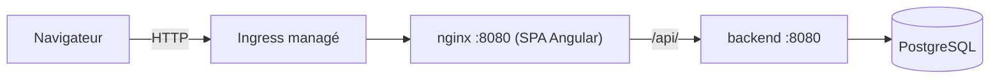

# azure-quiz-frontend

Angular application to review Microsoft certifications (AZ-900 to start, AZ-104 next): review by
module or mock exam, accessible from a simple link (no account). Consumes the REST API of
[azure-quiz-backend](../azure-quiz-backend).


## Stack

- Angular 22 (standalone components, signals), Angular Material, ngx-translate (fr/en)
- Vitest (Angular CLI 22 native test runner)
- ESLint (`angular-eslint`) + Prettier, husky + lint-staged on pre-commit

## Run locally

Prerequisites: Node 22+, and the backend (`azure-quiz-backend`) running on `http://localhost:8080`.

```bash
npm install
npm start   # http://localhost:4200, targets the API on localhost:8080 (see src/environments/environment.development.ts)
```

## Tests and quality

```bash
npm test           # Vitest
npm run test:coverage
npm run lint
npm run format:check
```

## Production build

```bash
npm run build:prod
```

Static output in `dist/azure-quiz-frontend/browser` (that's the folder to point to as
`output_location` when deploying to Azure Static Web Apps).

Before building for a real deployment, update `src/environments/environment.ts` with the deployed
backend API URL (`apiBaseUrl`).


## Structure

- `src/app/core` — models, services (`QuizApiService` for REST calls, `QuizSessionStore` for
  signal-based quiz session state)
- `src/app/features` — pages: `certifications` (home), `modules` (a certification's modules +
  starting a mock exam), `quiz` (question-by-question flow), `results` (final score)

## Out of scope for this repo

- Provisioning the Azure infrastructure (Static Web App, App Service, database).

## Architecture applicative



nginx sert l'application Angular et relaie `/api/` vers le Service `backend`, ce
qui évite tout CORS côté navigateur. `/healthz` sert aux sondes Kubernetes.

## Déploiement sur AKS

Le workflow `deploy.yml` est déclenché à la main : build de l'image (arguments
`API_BASE_URL` et `API_KEY`), push, application des manifests `k8s/` dont
l'Ingress (hôte injecté par la CI).

## DevSecOps

| Workflow | Outil | Rôle | Bloquant ? | Justification |
|---|---|---|---|---|
| `sast` | CodeQL | Analyse statique du code source | Non (résultats dans Security > Code scanning) | La doc GitHub traite les alertes comme des résultats à trier dans l'onglet Security, avec vérification « Code scanning results » sur les PR. |
| `sca` | OSV-Scanner | Dépendances vulnérables connues | Oui | Arriéré soldé à la remédiation (0 vulnérabilité sur `package-lock.json`), le scan est devenu bloquant pour empêcher toute régression. Rapport dans le Job Summary. |
| `secrets` | gitleaks (binaire `gitleaks dir . --redact -v`) | Secrets dans le code | Oui | Un secret commité est un incident, code de sortie 1 documenté par gitleaks. `--redact` masque la valeur. |
| `container-iac` | Trivy | Misconfigurations (Dockerfile, k8s) et CVE de l'image (paquets OS) | Oui : HIGH et CRITICAL | Seuil recommandé par Trivy pour un gate CI ; `--ignore-unfixed` écarte ce qu'on ne peut pas corriger ; les bibliothèques applicatives sont couvertes par `sca`. |
| `sonarcloud` | SonarCloud | Qualité et Quality Gate | Oui (`sonar.qualitygate.wait=true`) | Le Quality Gate est le livrable ; nécessite le secret `SONAR_TOKEN`. |
| `a11y` | axe-core (WCAG 2.0 A et AA) | Accessibilité de l'application construite | Non | Un audit automatique ne couvre qu'une partie des critères WCAG, il ne peut pas servir de barrière seul. Rapport JSON en artifact. |

Les résultats se lisent dans l'onglet **Actions** (Job Summary de chaque job),
dans les **artifacts** (rapport axe) et dans **Security > Code scanning**.

Aucun scan n'est désactivé sans commentaire justificatif. Le DAST (OWASP ZAP)
n'est lancé qu'après le déploiement, en mode baseline par défaut ; le full scan
est limité au seul hôte `mohamed-saidi.20.74.93.53.nip.io`.

Sources : docs GitHub Code scanning, OSV-Scanner (google.github.io/osv-scanner),
gitleaks (github.com/gitleaks/gitleaks), Trivy (trivy.dev/docs), SonarQube Cloud
(docs.sonarsource.com/sonarqube-cloud), axe-core (github.com/dequelabs/axe-core).
